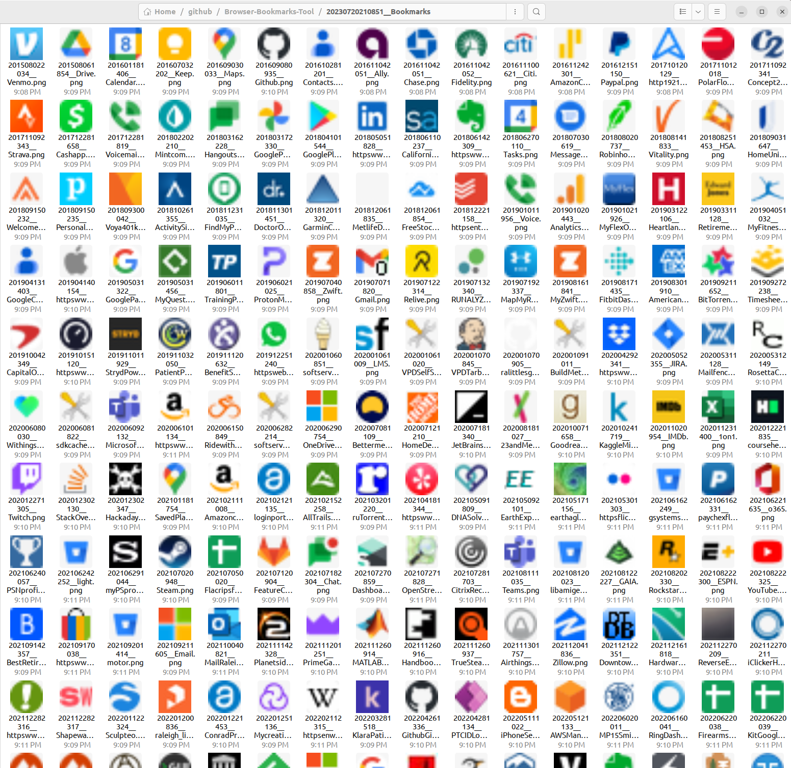

# About

Browsers allow you to export your bookmarks into an HTML file, that uses the [Netscape Bookmark File Format](https://learn.microsoft.com/en-us/previous-versions/windows/internet-explorer/ie-developer/platform-apis/aa753582(v=vs.85)).

This repository contains a set of Python scripts, allowing you to:

* Export the saved icons associated with each bookmark
* Create a CSV file out of all bookmarks, to check if a bookmark's URL is still accessible

More to come...

# Usage

```
usage: netscape_bookmark_tool.py [-h] -f INPUT_BOOKMARK_FILE

options:
  -h, --help            show this help message and exit
  -f INPUT_BOOKMARK_FILE, --input-bookmark-file INPUT_BOOKMARK_FILE
                        The full path to the Netscape format bookmark file
```

After running this script, you'll see:

* a directory created with all of your bookmark icon images



* a CSV file containing all of your bookmarks, along with a bool column to indicate if the URL is accessible
* all links from your bookmarks, available in a single text file